# dp-doorlock – system zamków drzwi dla FiveM

Rozbudowany system zamków: klucze, PIN-y, karty dostępu, biometria, wytrychy, hakowanie czytników,
termit i taran, blokady całych budynków, harmonogramy, autozamki, klucze cyfrowe, alarmy
dla policji i edytor drzwi w grze. Wszystko ma własny, dopracowany interfejs NUI.
Zasób był pisany z myślą o **wydajności** (szczegóły w sekcji [Wydajność](#wydajność)).

- Frameworki: **ESX, QBCore, QBox** (wykrywane automatycznie) albo standalone
- Ekwipunki: **ox_inventory, qb-inventory, ESX** (wykrywane automatycznie)
- Zapis: plik `data/doors.json` + KVP zasobu, **bez bazy danych**
- Zero plików audio i obrazków: ikony w SVG, dźwięki syntezowane w WebAudio, minigry rysowane na canvasie
- 4 motywy kolorystyczne: `aurora`, `noir`, `ember`, `ice`

| | |
|---|---|
| 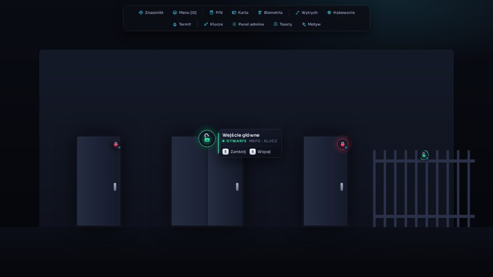 | 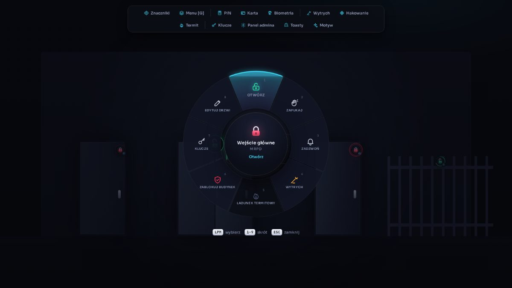 |
| 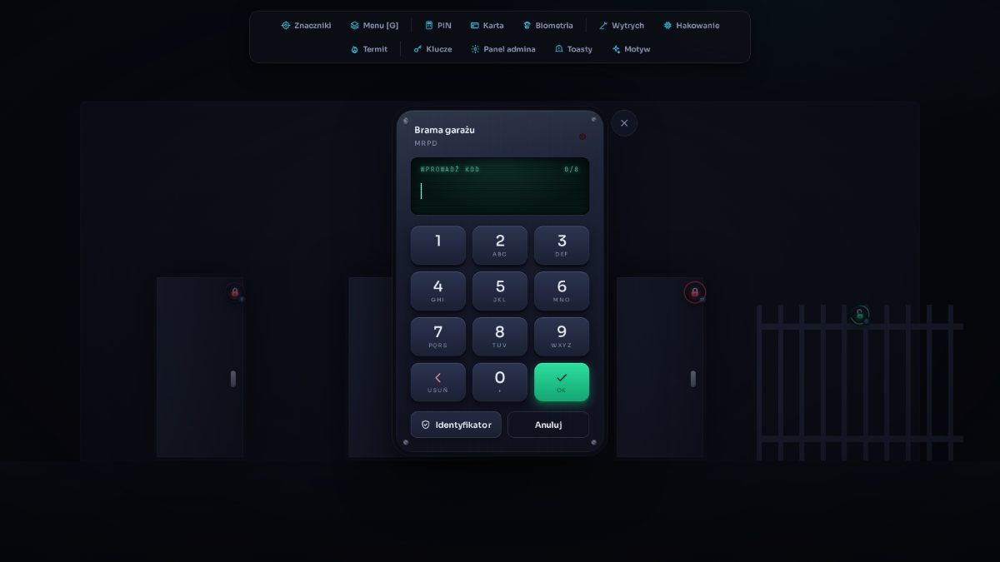 | 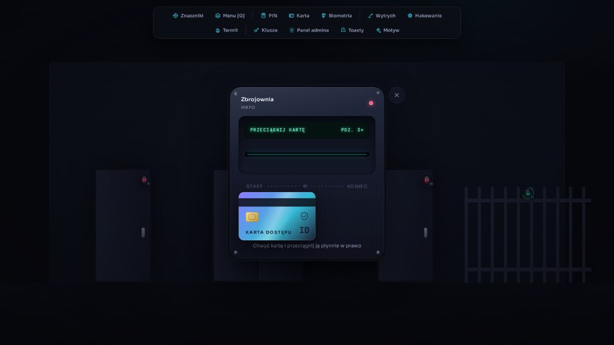 |
| 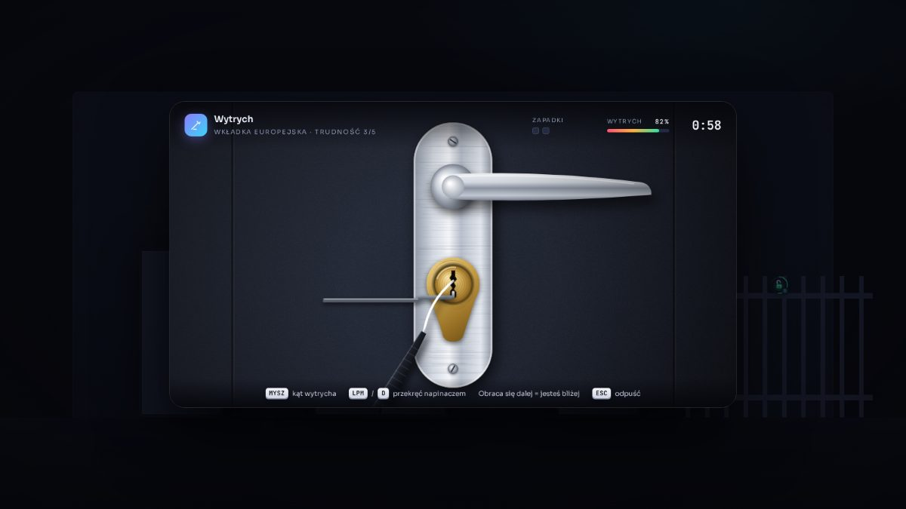 |  |
| 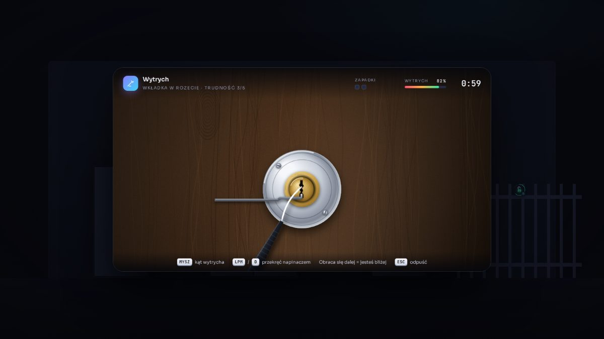 | 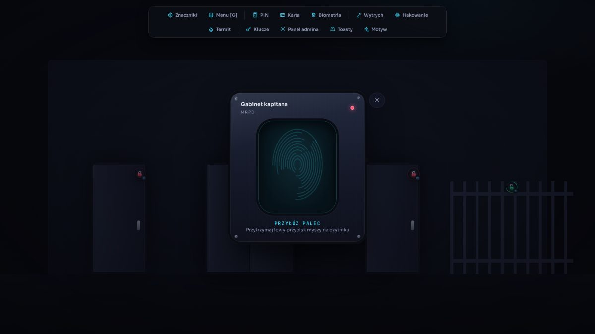 |
| 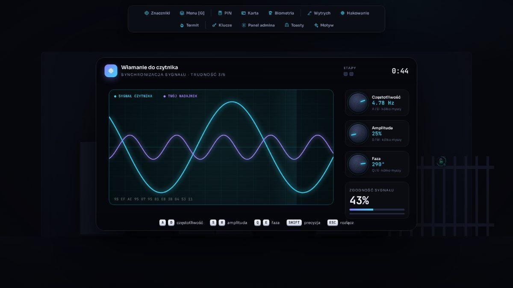 | 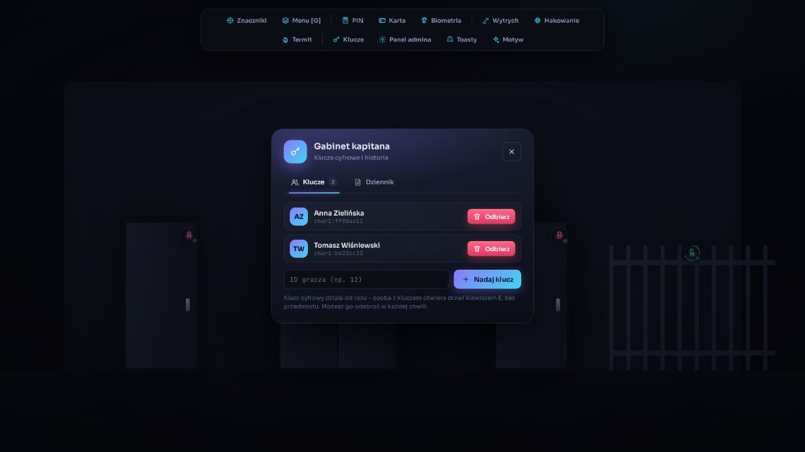 |
| 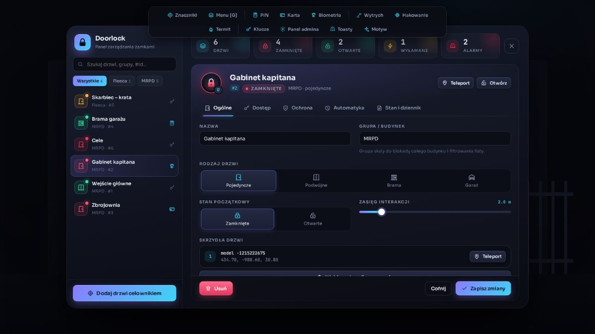 | 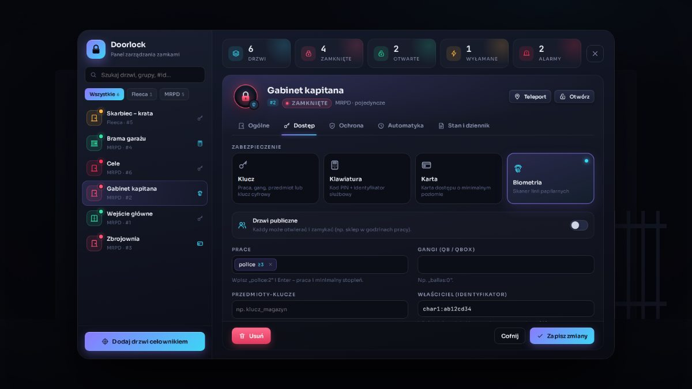 |

---

## Funkcje

### Znaczniki w świecie
- Przy drzwiach unosi się kłódka w kolorze stanu: **zamknięte**, **otwarte**, **wyłamane**, **blokada** (animowane pasy), **alarm** (pulsujące fale).
- Kabłąk kłódki animuje się przy otwieraniu, a przy wyłamaniu odpada.
- Gdy stoisz przy drzwiach, znacznik rozwija się w kartę z nazwą, grupą, rodzajem zabezpieczenia i podpowiedziami klawiszy `[E]` i `[G]`.
- Przy autozamku pierścień wokół ikony odlicza czas do zamknięcia.
- Znacznik jest zawsze na środku skrzydła, nie przy zawiasie (liczone z wymiarów modelu). Nie widać go przez ściany (asynchroniczny raycast).
- Po udanym otwarciu pojawia się fala, po odmowie ikona się trzęsie.

### Rodzaje zabezpieczeń
| Zabezpieczenie | Jak otworzyć |
|---|---|
| **Klucz** (`standard`) | Praca/stopień, gang, przedmiot-klucz, klucz cyfrowy, właściciel, drzwi publiczne |
| **Klawiatura** (`keypad`) | Kod PIN na klawiaturze z wyświetlaczem LCD albo przycisk **Identyfikator** dla osób z dostępem służbowym. Po 3 błędach blokada na 60 s i opcjonalny alarm |
| **Karta** (`card`) | Przeciągnięcie karty przez czytnik we właściwym tempie. Za szybko, za wolno albo z cofnięciem odczyt się nie uda. Wymagany minimalny poziom karty |
| **Biometria** (`bio`) | Przytrzymanie palca na skanerze. Linie papilarne podświetlają się w trakcie skanu |

### Rodzaje drzwi
Pojedyncze, **podwójne** (dwa skrzydła synchronizowane), **bramy przesuwne** i **garażowe** (otwierają się automatycznie, większy zasięg, obsługa z pojazdu).

### Menu akcji `[G]`
Menu radialne w stylu koła broni z GTA: wybór kątem myszy, klawiszami 1–9 albo klikiem. Serwer decyduje, co pokazać. Niedostępne akcje są wyszarzone z powodem (np. „Brak potrzebnego przedmiotu”).

| Akcja | Dla kogo | Opis |
|---|---|---|
| Otwórz / zamknij | z dostępem | ścieżka zależna od zabezpieczenia |
| Zapukaj | każdy | stukanie słyszą gracze w promieniu 14 m |
| Zadzwoń | każdy (jeśli drzwi mają dzwonek) | ding-dong + powiadomienie dla osób z dostępem w pobliżu |
| Wytrych | przestępcy | zbliżenie na zamek, szukanie punktu i napinacz; trudność 1–5 |
| Włam do czytnika | przestępcy | minigra synchronizacji sygnału (zamki elektroniczne) |
| Ładunek termitowy | przestępcy | 12 s palenia z efektem cząsteczkowym → zamek przepalony + alarm |
| Wyważ taranem | służby | kopnięcie/taran → drzwi wyłamane |
| Napraw zamek | z dostępem / mechanik | przywraca zamek po wyłamaniu |
| Zablokuj budynek | policja (od stopnia z configu) | zamyka wszystkie drzwi grupy, blokuje otwieranie |
| Klucze | właściciel / admin | nadawanie i odbieranie kluczy cyfrowych + dziennik |
| Zmień PIN | z dostępem | nowy kod wpisany dwa razy na klawiaturze |
| Edytuj drzwi | admin | otwiera panel na tych drzwiach |

### Minigry
- **Wytrych (tryb `front`, domyślny).** Zbliżenie na zamek jak w symulatorach włamywacza, a kamera w grze najeżdża na klamkę. Trzy modele zamków rysowane od zera:
  - **wkładka europejska w szyldzie** ze szczotkowanej stali, z klamką, na stalowych drzwiach;
  - **wkładka w chromowanej rozecie** na drewnianych drzwiach ze słojami;
  - **kłódka** z laminowanej stali na kracie celi. Po otwarciu kabłąk wyskakuje.

  Myszą obracasz wytrych wokół kanału klucza, a LPM, `D` lub spacją przekręcasz bębenek napinaczem. Im bliżej właściwego punktu, tym dalej bębenek się obraca. Poza nim zamek się blokuje, drga i skrzypi, wytrych się wygina i w końcu pęka (odłamek spada). Na wyższych poziomach jest 2–3 zapadek, każda z nowym punktem. Pęknięcie w minigrze zawsze zabiera wytrych z ekwipunku.
- **Wytrych (tryb `pins`).** Przekrój wkładki: podnosisz zapadki jedna po drugiej do linii ścinania. Naraz „wiąże” tylko jedna. Tryb `mixed` używa go przy trudności 5.
- **Hakowanie.** Oscyloskop z sygnałem czytnika. Trzema pokrętłami (częstotliwość, amplituda, faza) dopasowujesz swoją falę. Po zatrzaśnięciu 1–3 etapów zamek puszcza. Na wyższych poziomach sygnał dryfuje i szumi. Porażka blokuje czytnik dla gracza i może włączyć alarm.

### Automatyka
- **Autozamek** po X sekundach (odliczanie na znaczniku).
- **Harmonogram**: w podanych godzinach (czas serwera) drzwi są otwarte, poza nimi zamknięte. Działa też przez północ, np. 22:00–06:00.
- **Pamięć stanu** po restarcie serwera (KVP).
- **Wyłamanie** wygasa po czasie z configu albo trwa do naprawy.

### Bezpieczeństwo i antycheat
- Serwer jest jedynym źródłem prawdy: sprawdza dystans, uprawnienia, przedmioty i stan przy każdej akcji.
- PIN nigdy nie trafia do klienta. Klient dostaje tylko publiczny widok drzwi.
- Minigry i akcje czasowe mają **jednorazowe tokeny sesji** i **minimalny czas trwania**, więc nie da się „zgłosić sukcesu” z executora.
- Limit zapytań: jedno na 200 ms na akcję na gracza.
- Dane z edytora są normalizowane i przycinane (typy, zakresy, długości, znaki HTML).

### Panel administratora `/doorlock`
- Lista drzwi z wyszukiwarką, filtrem grup i kolorowym stanem. Statystyki na żywo (zamknięte, otwarte, wyłamane, alarmy).
- **Dodawanie celownikiem**: celujesz w drzwi, obiekt dostaje fioletowy obrys, `[E]` dodaje skrzydło, `[ENTER]` zatwierdza. Model i pozycja są pobierane z gry.
- Edytor z zakładkami: *Ogólne, Dostęp, Ochrona, Automatyka, Stan i dziennik*, z podglądem znacznika na żywo, osią doby dla harmonogramu i edytorem prac w formie tagów (`police:2`).
- Szybkie akcje: zamknij, otwórz, wyłam, napraw, test alarmu, blokada grupy, teleport.
- Dziennik zdarzeń (kto, co, kiedy, czym) w formie osi czasu.

### Alarmy
Włamanie, termit albo zablokowana klawiatura wysyła policji migający blip, dźwięk i toast. Jest też hak `ServerHooks.Dispatch` do ps-dispatch, cd_dispatch itd. Opcjonalnie webhook Discord (`Config.Webhook` w `server/hooks.lua`).

---

## Wydajność

| Problem | Rozwiązanie |
|---|---|
| Sprawdzanie tysięcy drzwi co klatkę | **Siatka przestrzenna** (komórki 64 m). Wolna pętla co 500 ms przegląda tylko 9 komórek wokół gracza |
| Pętla `Wait(0)` zawsze aktywna | Szybka pętla działa **tylko przy drzwiach w zasięgu UI**. Inaczej śpi 750 ms |
| Sprawdzanie klawiszy co klatkę | `RegisterKeyMapping` – zero pętli klawiszy (gracz może też zmienić bind w ustawieniach GTA) |
| Spam `SendNUIMessage` | Pozycja znacznika leci do NUI tylko po realnej zmianie (> 0,0015 ekranu). W bezruchu szybka pętla nic nie wysyła i nic nie alokuje |
| Raycasty widoczności | Asynchroniczne (`StartShapeTestLosProbe`), wynik odczytywany w następnym przebiegu wolnej pętli |
| Szukanie obiektu drzwi | Raz na drzwi, z odstępem 2 s przy niepowodzeniu. Wynik jest cache'owany |
| Odpytywanie stanów przez serwer | Brak. Autozamek i koniec wyłamania to `SetTimeout` z tokenem, harmonogram tyka co 30 s i tylko wtedy, gdy jakieś drzwi go mają |
| Rozsyłanie stanów | Kompaktowa delta jednego wpisu (`{ l, b, d, a, t }`) tylko przy zmianie |
| Zapisy na dysk | Zapis odroczony (debounce): wiele edycji to jeden zapis pliku |
| Dziennik | Bufor cykliczny O(1) o stałym rozmiarze |
| Animacje NUI | Tylko `transform` i `opacity`. Odliczanie autozamka to jedno przejście CSS (zero JS na klatkę). Canvas i rAF działają tylko w otwartej minigrze |
| `backdrop-filter` | Celowo nieużywany: NUI i tak nie widzi gry pod spodem, a ten efekt kosztuje GPU |

Wszystkie parametry są w `Config.Perf`.

---

## Instalacja
1. Wrzuć folder `dp-doorlock` do `resources/`.
2. W `server.cfg`, **po** frameworku i ekwipunku:
   ```
   ensure dp-doorlock
   add_ace group.admin dp-doorlock.admin allow
   ```
3. Dodaj przedmioty do ekwipunku (nazwy w `Config.Items` i `Config.Keycards`): `lockpick`, `advancedlockpick`, `hacking_device`, `thermite`, `police_ram`, `keycard_green|blue|red|black`.
4. Drzwi z `Config.Doors` zostaną dodane przy pierwszym starcie. Kolejne dodawaj w grze komendą `/doorlock` → **Dodaj drzwi celownikiem**.
5. Współrzędne w `config.lua` dotyczą vanilla GTA. Przy MLO dodaj drzwi celownikiem.

### Komendy
| Komenda | Opis |
|---|---|
| `/doorlock` | panel administratora (ACE `dp-doorlock.admin` lub admin frameworka) |
| `/lockdown <grupa> [off]` | blokada budynku (także z konsoli serwera) |

### Podgląd interfejsu w przeglądarce
Otwórz `html/index.html` w Chrome. Zobaczysz scenę demo z paskiem do otwierania każdego elementu.
Parametry: `?open=admin|radial|keypad|card|bio|lockpick|hack|keys|progress`, `?theme=noir|ember|ice`.
W demo PIN to `1337`.

---

## API dla innych zasobów

```lua
-- serwer (ref = id liczbowy albo `key` z configu, np. 'mrpd_front')
exports['dp-doorlock']:SetLocked(ref, true)
exports['dp-doorlock']:IsLocked(ref)
exports['dp-doorlock']:GetDoor(ref)            -- publiczny widok (bez PIN-u)
exports['dp-doorlock']:GetState(ref)           -- { l, b, d, a, t }
exports['dp-doorlock']:SetLockdown('MRPD', true)
exports['dp-doorlock']:Breach(ref, 600)        -- wyłam na 600 s
exports['dp-doorlock']:Repair(ref)
exports['dp-doorlock']:TriggerAlarm(ref, 'napad')

-- zdarzenie przy każdej zmianie zamka
AddEventHandler('dp-doorlock:changed', function(id, locked, src, reason) end)

-- klient
exports['dp-doorlock']:GetClosestDoor()        -- id drzwi, przy których stoi gracz
exports['dp-doorlock']:IsLocked(id)
```

---

## Pomysły na rozwój

Rzeczy, które dobrze pasują do tej architektury. Większość da się dodać bez przebudowy.

**Mechanika zamków**
1. **Zamki wielostopniowe**, np. karta + PIN + biometria jedna po drugiej (skarbce, laboratoria).
2. **Zasada dwóch osób**: dwóch strażników z dostępem musi potwierdzić w ciągu 5 s (zbrojownia).
3. **Kody jednorazowe (OTP)**: właściciel generuje kod gościa ważny 1 godzinę albo 1 wejście.
4. **Klucze czasowe**: klucz cyfrowy wygasa po X dniach (wynajem mieszkań, hoteli, motelu).
5. **Zamki pogodowe / zasilanie**: po awarii prądu (np. napad na elektrownię) zamki elektroniczne w dzielnicy „padają” otwarte albo zamknięte, zależnie od konfiguracji fail-safe/fail-secure.
6. **Zużycie zamka**: każde wyłamanie obniża wytrzymałość, a po kilku potrzebna jest wymiana u ślusarza.
7. **Drzwi pancerne** odporne na termit: wymagają wiertła (minigra z przegrzewaniem wiertła).
8. **Magnetyczne zamki awaryjne**: przy alarmie pożarowym wszystkie drzwi się otwierają (eksport `FireAlarm(group)`).

**Rozgrywka i RP**
9. **Praca ślusarza**: dorabianie kluczy (przedmiot z metadanymi), wymiana wkładek, naprawa zamków za pieniądze.
10. **Kradzież karty**: przeszukanie gracza albo NPC-strażnika daje kartę z jego poziomem.
11. **Klonowanie kart**: urządzenie skimmer kopiuje kartę, gdy stoisz obok ofiary przy czytniku.
12. **Podglądanie PIN-u**: gracz stojący za kimś przy klawiaturze widzi wciskane klawisze (z szansą błędu).
13. **Wizjer**: `[G] → Wizjer` pokazuje kamerę z drugiej strony drzwi, jak w prawdziwym judaszu.
14. **Kamery i monitoring**: każde otwarcie zostawia „nagranie” z imieniem, a policja przegląda je w panelu (dowody).
15. **Hotele i motele**: automatyczne przypisywanie pokoju, karta-klucz wydawana w recepcji.
16. **Pułapki**: właściciel montuje granat hukowy albo alarm cichy na drzwi.
17. **Drzwi gangów**: przejęcie terytorium automatycznie przepisuje dostęp.
18. **Drzwi pojazdów/kontenerów** tym samym systemem (kontenery w porcie, ciężarówki z towarem).
19. **Zaproszenia**: gospodarz daje gościom dostęp na czas imprezy jednym kliknięciem.

**Technologia i UI**
20. **Aplikacja w telefonie** (lb-phone, qs-smartphone, npwd): zdalne zamykanie domu, powiadomienia push o dzwonku i włamaniu.
21. **Tablet ochrony**: mapa budynku z żywym stanem wszystkich drzwi, zdalne otwieranie, dziennik.
22. **Interkom**: dzwonek łączy się głosowo (pma-voice) z właścicielem, który może otworzyć zdalnie.
23. **Integracja z ox_target** jako alternatywa dla klawiszy.
24. **Dźwięki 3D** zamków (xsound / natywne) słyszalne przez innych graczy.
25. **Importer z ox_doorlock / qb-doorlock / nui_doorlock**: jednorazowa konwersja istniejących konfiguracji.
26. **Eksport i import grup drzwi** do pliku (paczki MLO: „wklej MRPD Gabz”).
27. **Tryb podglądu stref** dla admina: wszystkie drzwi na mapie z kolorami stanów.
28. **Statystyki**: najczęściej wyłamywane drzwi, godziny szczytu, ranking włamywaczy (dla policji).
29. **Wielojęzyczność**: plik `locales/en.lua` i tłumaczenia NUI.
30. **Motywy tworzone przez serwer**: kolory i font z configu, bez edycji CSS.

---

## Struktura plików

```
dp-doorlock/
├── config.lua            konfiguracja + przykładowe drzwi
├── shared/door.lua       model drzwi, normalizacja, harmonogram
├── bridge/server.lua     ESX / QB / QBox / standalone + ekwipunki
├── server/
│   ├── hooks.lua         dispatch, webhook Discord
│   ├── storage.lua       doors.json, KVP stanów, dziennik (bufor cykliczny)
│   ├── main.lua          stan, autoryzacja, synchronizacja, harmonogram, eksporty
│   ├── actions.lua       menu, pukanie, dzwonek, minigry, termit, taran, naprawa, klucze
│   └── admin.lua         CRUD dla panelu
├── client/
│   ├── hooks.lua         powiadomienia, blip alarmu, warunki interakcji
│   ├── core.lua          callbacki, fokus NUI, animacje
│   ├── doors.lua         rejestr, siatka przestrzenna, znaczniki
│   ├── interact.lua      klawisze, radial, klawiatura, czytniki, minigry, akcje czasowe
│   └── admin.lua         panel i wybór drzwi celownikiem
├── html/                 NUI (vanilla JS, bez bibliotek)
└── data/doors.json       tworzony automatycznie (ignorowany przez git)
```
